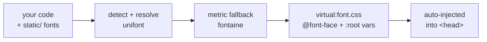

<div align="center">

# @svelte-plugin/font

**Every Google Font at your fingertips — type a name, and it's loaded, self-hostable, and layout-shift-free. Automatically.**

Just use a font in your code. The plugin finds it across ~1,900 Google Fonts (or your own local
files), loads it, generates a metric-matched fallback that all but eliminates layout shift, wires
up CSS variables, and injects everything — no `@font-face`, no `<link>`, no config.


</div>

---

It's a Vite port of the ideas in [`@nuxt/fonts`](https://github.com/nuxt/fonts), built on
[unifont](https://github.com/unjs/unifont) (font resolution) and
[fontaine](https://github.com/unjs/fontaine) (CLS-reducing metric fallbacks), tailored for
SvelteKit and Tailwind v4.

## Features

- 🪄 **Zero config** — `font()` and you're done. It detects the fonts you actually use.
- 🔤 **Type-safe** — autocomplete across 1,900+ Google fonts; a typo is a compile error.
- 📉 **No layout shift** — auto-generates metric-matched `@font-face` fallbacks (size-adjust + ascent/descent/line-gap), so swapping in the web font barely moves a pixel.
- 🎨 **Tailwind v4 aware** — sets `--font-sans` / `--font-serif` / `--font-mono` by category; `font-['Inter']` arbitrary values get the fallback too.
- 🏠 **Local fonts** — drop files anywhere in `static/`; family/weight/style are read from the binary, no naming convention.
- ☁️ **CDN or self-host** — keep Google's CDN, or download the `woff2` into your `static/` folder with one option.
- 🔡 **Variable fonts** — loaded as a single variable face across the full `wght` range, metrics included.
- 🚫 **No imports** — the stylesheet is injected automatically; works with or without a `+layout.svelte`.
- ⚡ **Dev HMR** — edit your code, fonts update; no full reload.

## Setup CLI

The fastest way to add the plugin to an existing SvelteKit/Vite project:

```bash
npx @svelte-plugin/font
```

It locates your `vite.config.{ts,js,mjs}`, installs the package with your detected package
manager, asks whether to self-host or use the CDN, lets you search/pick Google fonts (optional —
auto-detect handles the rest), and idempotently inserts `font()` into your plugins array (before
`tailwindcss()` / `sveltekit()`). Re-running is safe — it never duplicates the import or the plugin.

Non-interactive (CI-friendly) flags — a flag overrides its prompt, and nothing prompts when not a TTY:

```bash
npx @svelte-plugin/font --fonts=Inter,Roboto --source=download
```

| Flag | Description |
|---|---|
| `--fonts=A,B,C` | Comma-separated families. Empty (`--fonts=`) relies on auto-detect. |
| `--source=cdn\|download` | Use the Google CDN (default) or self-host woff2 into `static/hosted_fonts`. |
| `--pm=npm\|pnpm\|yarn\|bun` | Package manager (default: detected from the lockfile). |
| `-y, --yes` | Accept defaults and skip confirmations. |
| `--skip-install` | Print the install command instead of running it. |
| `--cwd=PATH` | Project directory (default: current directory). |
| `--dry-run` | Print the edited config without writing or installing. |
| `-h, --help` | Show usage. |

## Installation

Or add it manually:

```bash
npm install -D @svelte-plugin/font
```

> Requires **SvelteKit** + **Vite**. **Tailwind v4** is optional (auto-detected). `unifont` and
> `fontaine` come along as dependencies.

## Quick start

Add the plugin to `vite.config.ts` — **before** `tailwindcss()` and `sveltekit()`:

```ts
// vite.config.ts
import { sveltekit } from '@sveltejs/kit/vite';
import tailwindcss from '@tailwindcss/vite';
import font from '@svelte-plugin/font';
import { defineConfig } from 'vite';

export default defineConfig({
  plugins: [
    font(),          // 👈 zero config: detects the fonts you use
    tailwindcss(),
    sveltekit(),
  ],
});
```

That's it. Use a font anywhere and it just works:

```svelte
<h1 class="font-sans">Hello</h1>          <!-- Tailwind utility -->
<p style="font-family: 'Inter'">Hello</p>  <!-- raw declaration -->
<style>
  h1 { font-family: 'Playfair Display', serif; }
</style>
```

No `@font-face`, no imports, no `<link>` tags. The plugin finds `Inter` / `Playfair Display`,
loads them, builds metric-matched fallbacks, and rewrites your declarations to use them.

### Or declare fonts explicitly

You only need a `fonts` list to pin weights/subsets or set per-font options:

```ts
font({
  fonts: [
    'Inter',
    'JetBrains Mono',
    { family: 'Roboto', weights: [400, 700], subsets: ['latin', 'latin-ext'] },
  ],
});
```

## Usage

### In your styles

Reference fonts however you like — all three get the metric fallback:

| You write | Resolves to |
|---|---|
| `class="font-sans"` (Tailwind) | `var(--font-sans)` → web font + fallback chain |
| `class="font-['Inter']"` (Tailwind arbitrary) | rewritten to `var(--font-inter)` |
| `font-family: 'Inter'` (CSS) | rewritten to `var(--font-inter), …` |
| `font: 700 2rem Inter` (shorthand) | rewritten to `font: 700 2rem var(--font-inter)` |
| `var(--font-inter)` (manual) | web font + `"Inter fallback"` + system fonts |

### Tailwind `@theme`

Define a theme font and it gets the fallback chain automatically:

```css
/* app.css */
@import 'tailwindcss';

@theme {
  --font-serif: 'Playfair Display', serif;
}
```

`font-serif` now resolves to `"Playfair Display", "Playfair Display fallback", "Times New Roman", …`.

### A custom CSS variable

```ts
font({ fonts: [{ family: 'Playfair Display', cssVariable: '--font-display' }] });
```

```svelte
<h1 style="font-family: var(--font-display)">…</h1>
```

### Self-host Google fonts

Don't want to depend on Google's CDN? Download the files into your project:

```ts
font({ fonts: ['Inter'], source: 'download' }); // → static/hosted_fonts/*.woff2
```

### Local fonts

Drop font files **anywhere under `static/`** and they're picked up automatically — **no
config, no naming convention, no required folder**. Family, weight, style, and variable axes
are read straight from each binary (via [fontkit](https://github.com/foliojs/fontkit)):

```
static/
  brand.woff2
  fonts/Cal Sans/cal-sans.woff2
  whatever/you/like/Geist[wght].woff2
```

Each file is served from its path under `static/` (so `static/brand.woff2` → `/brand.woff2`).
The download-mode dir (`static/hosted_fonts/`) is skipped, so self-hosted Google fonts aren't
re-scanned as local.

Local families get the same treatment as Google ones (CLS fallback, CSS variables, rewriting,
auto-detection). The **category is detected from the binary** — monospace reliably (so a
self-hosted IBM Plex Mono gets a mono fallback), serif when the font declares it, else `sans`.
Override category/variable per family (keyed by the binary family name) when needed:

```ts
font({ local: { families: { 'Cal Sans': { category: 'serif', cssVariable: '--font-brand' } } } });
```

A local font wins over a Google family of the same name. `woff2` is recommended, but any of
`woff` / `ttf` / `otf` work; multiple formats of the same face merge into one `@font-face`.

> **Heads-up:** *every* parseable font under `static/` becomes a published webfont. If you keep
> fonts there for other reasons (OG-image rendering, PDF/canvas, asset samples), put them in a
> dedicated folder and skip it:
> ```ts
> font({ local: { exclude: ['og', 'assets'] } }); // skips static/og/ and static/assets/
> ```

## Configuration

```ts
font(options?: FontPluginOptions)
```

| Option | Type | Default | Description |
|---|---|---|---|
| `fonts` | `FontEntry[]` | `[]` | Fonts to load. A `GoogleFontName` string, or `{ family, weights?, styles?, subsets?, category?, cssVariable? }`. Omit for pure auto-detect. |
| `provider` | `'google'` | `'google'` | unifont provider. |
| `source` | `'cdn' \| 'download'` | `'cdn'` | `cdn` keeps Google URLs; `download` self-hosts woff2 into `static/hosted_fonts/`. |
| `autoDetect` | `boolean` | `true` | Scan `src/**` for `font-family`, Tailwind `font-[…]`, and `@theme --font-*` usages and add any registered Google font. |
| `local` | `boolean \| { families, exclude }` | `true` | Recursively scan `static/` (excluding `hosted_fonts/`) for self-hosted fonts. `false` disables; `{ families }` for per-family overrides; `{ exclude: ['dir'] }` to skip top-level dirs. |
| `tailwind` | `boolean \| 'auto'` | `'auto'` | Detect Tailwind and set `--font-sans/serif/mono` by category. |
| `display` | `FontDisplay` | `'swap'` | `font-display` descriptor. Use `'optional'` to avoid the visible swap entirely. |
| `rewrite` | `boolean` | `true` | Rewrite `font-family: X` → `var(--font-x)` so raw usages get the fallback. |
| `inject` | `boolean` | `true` | Auto-inject the stylesheet (no manual import). Set `false` to import `virtual:font.css` yourself. |
| `staticDir` | `string` | `'static'` | Static assets directory. |

**Variable fonts** are supported out of the box — declared or detected variable fonts load as a
single face spanning their full `wght` range.

## FAQ

<details>
<summary><b>Do I need to import anything in my app?</b></summary>

No. The plugin injects its stylesheet into SvelteKit's root component, so it lands in
`<head>` on every route — with or without a `+layout.svelte`. Set `inject: false` and
`import 'virtual:font.css'` yourself if you prefer.
</details>

<details>
<summary><b>I still see a flash when the font loads.</b></summary>

That's **FOUT** (the glyphs repainting), not layout shift — the metric fallback keeps the box
size stable so content doesn't move (CLS ≈ 0). If you want to avoid the visible swap entirely,
use `display: 'optional'` (trade-off: the web font may not appear on a slow first load).
</details>

<details>
<summary><b>Does it work without Tailwind?</b></summary>

Yes. Tailwind just lets `font-sans/serif/mono` utilities resolve to the plugin's variables.
Without it you still get `--font-<family>` variables and `font-family` rewriting.
</details>

<details>
<summary><b>Does the <code>font:</code> shorthand work?</b></summary>

Yes. The `font` shorthand (e.g. `font: 700 2rem Inter, sans-serif`) is both detected and
rewritten — the family is taken from the part after the `font-size`. The only thing not handled
is shorthands with no recognizable size (system keywords like `font: menu`), which have no
family to load anyway.
</details>

## How it works

The plugin runs entirely at **build/dev time** inside Vite. It resolves your fonts, asks
fontaine to compute a metric-matched fallback `@font-face` for each, assembles one stylesheet
(`virtual:font.css`) with the `@font-face` rules and `:root` variables, and injects it into
SvelteKit's head — then rewrites your `font-family` usages to point at the variables.



## Acknowledgements

Stands on the shoulders of [unifont](https://github.com/unjs/unifont),
[fontaine](https://github.com/unjs/fontaine), [capsize](https://github.com/seek-oss/capsize),
[fontkit](https://github.com/foliojs/fontkit), and [`@nuxt/fonts`](https://github.com/nuxt/fonts).

## License

[MIT](LICENSE)
